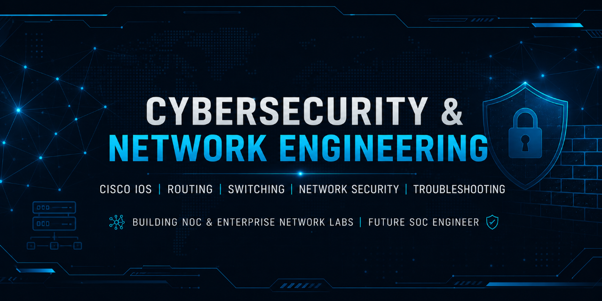

<!-- ================= BANNER ================= -->

  

# 👋 Hi, I'm Malaika Azhar

## Cybersecurity & Network Engineering (Entry-Level)

SOC & NOC Aspirant | Cisco IOS | Routing & Switching | VLANs | Network Security | Troubleshooting | IT Infrastructure

---

# 🧠 About Me

I am an entry-level Cybersecurity and Network Engineering learner focused on building strong practical skills in enterprise networking and security operations.

I specialize in hands-on lab environments using Cisco IOS and network simulation tools, where I practice real-world networking concepts including routing, switching, VLAN segmentation, IP addressing, subnetting, and troubleshooting.

I am actively developing skills toward SOC and NOC roles with a strong focus on network visibility, infrastructure understanding, and security fundamentals.

---

# 🔥 Technical Skills

## 🌐 Networking
- Cisco IOS Configuration
- Routing & Switching
- VLAN Segmentation
- Subnetting & IP Addressing
- ACL (Access Control Lists)
- Network Troubleshooting

## 🛡️ Cybersecurity Basics
- Network Security Fundamentals
- Wireshark Traffic Analysis
- Nmap Scanning
- SOC Fundamentals (learning phase)

## 💻 Systems
- Linux CLI Basics
- Windows Networking Basics
- Packet Tracer Labs

---

# 🧪 Hands-On Labs

### 🔹 Enterprise Network Design
- Multi-subnet architecture
- VLAN configuration
- Inter-VLAN routing

### 🔹 Network Security Lab
- ACL-based traffic filtering
- SSH secure remote access
- Basic access control simulation

### 🔹 Troubleshooting Labs
- DNS issues
- Gateway problems
- Routing misconfigurations

### 🔹 Packet Analysis
- Wireshark traffic inspection
- TCP/IP protocol analysis

---

# 📊 GitHub Stats

---

# 🧭 Current Learning Path

- Networking Fundamentals ✔
- Cisco IOS Labs ✔
- SOC Analyst Skills ⏳
- Ethical Hacking Basics ⏳
- SIEM & Monitoring Tools ⏳

---

# 🎯 Career Goal

To grow into:
- SOC Analyst (Blue Team)
- NOC Engineer
- Network Infrastructure Specialist

Focused on real-world lab experience and enterprise troubleshooting skills.

---

# 📫 Connect With Me

- LinkedIn: https://www.linkedin.com/in/malaika-azhar-tech
- GitHub: https://github.com/malaika-azhar

---

> “I learn by building real systems, not just reading theory.”
