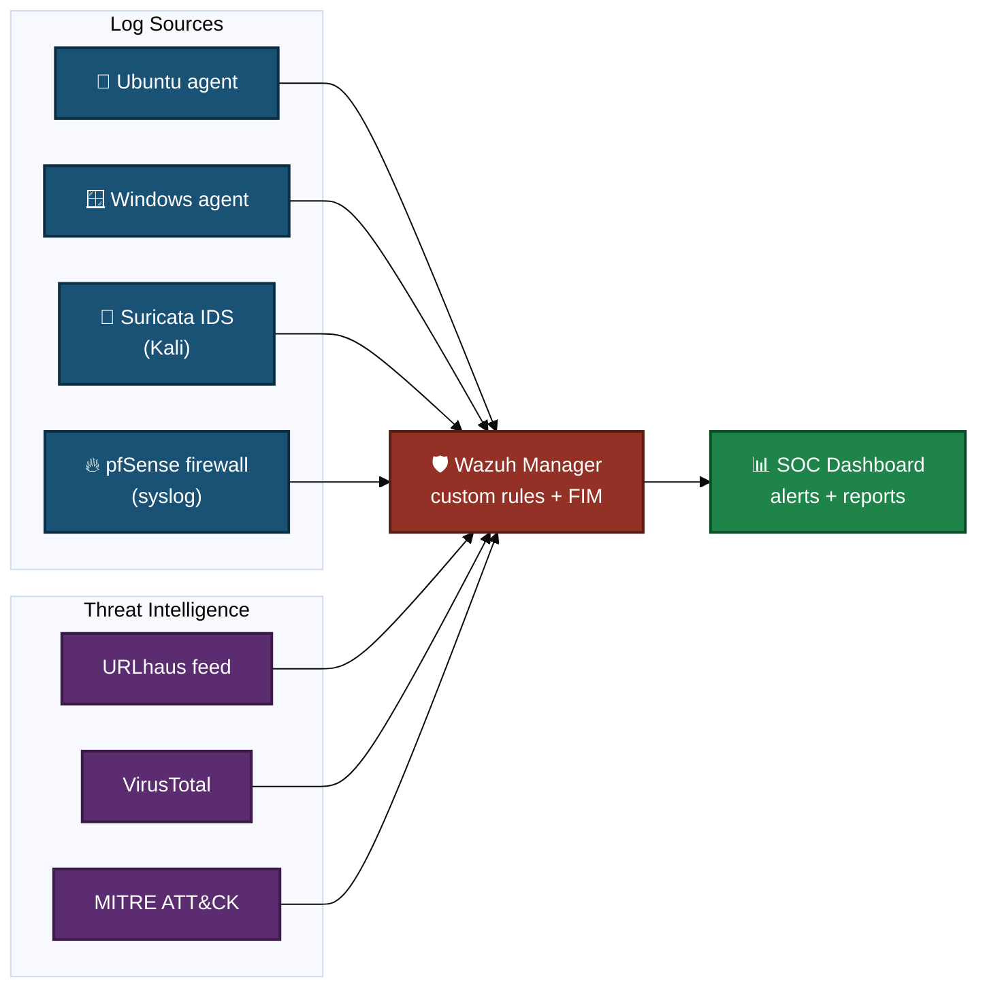
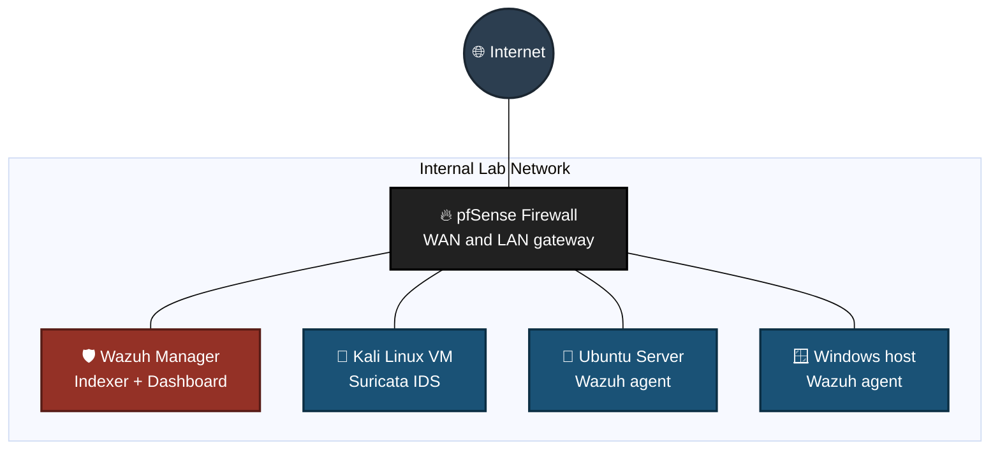
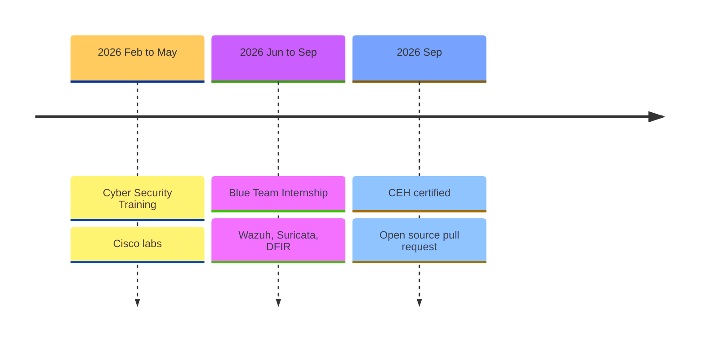

 

 

## 👩‍💻 About

BSCS student (2027) targeting **SOC Analyst and Blue Team roles**. I built a working detection lab with Wazuh, Suricata and pfSense, and every project is backed by screenshots.

 

## 🏅 Certifications

**Certified Ethical Hacker (C|EH)** · EC-Council · September 2026 · Certificate No. `ECC7025643981` · [Verify credential →](https://aspen.eccouncil.org/Verify)

 

## 📈 Internship Results

 

## 🧱 Lab Architecture

```mermaid
%%{init: {'theme': 'base', 'themeVariables': {'fontSize': '15px'}, 'flowchart': {'nodeSpacing': 35, 'rankSpacing': 50}}}%%
flowchart LR
    subgraph SRC["Log Sources"]
        UA["🐧 Ubuntu agent"]:::src
        WA["🪟 Windows agent"]:::src
        SU["🔎 Suricata IDS<br/>(Kali)"]:::src
        PF["🔥 pfSense firewall<br/>(syslog)"]:::src
    end
    subgraph TI["Threat Intelligence"]
        UH["URLhaus feed"]:::ti
        VT["VirusTotal"]:::ti
        AT["MITRE ATT&CK"]:::ti
    end
    UA --> WM
    WA --> WM
    SU --> WM
    PF --> WM
    UH --> WM
    VT --> WM
    AT --> WM
    WM["🛡️ Wazuh Manager<br/>custom rules + FIM"]:::core --> DB["📊 SOC Dashboard<br/>alerts + reports"]:::out
    classDef src fill:#1A5276,stroke:#0B2E43,stroke-width:2px,color:#FFFFFF
    classDef ti fill:#5B2C6F,stroke:#3B1A48,stroke-width:2px,color:#FFFFFF
    classDef core fill:#943126,stroke:#571C16,stroke-width:2px,color:#FFFFFF
    classDef out fill:#1E8449,stroke:#0B4F2A,stroke-width:2px,color:#FFFFFF
```

### Network Map

```mermaid
%%{init: {'theme': 'base', 'themeVariables': {'fontSize': '15px'}, 'flowchart': {'nodeSpacing': 40, 'rankSpacing': 55}}}%%
flowchart TB
    NET(("🌐 Internet")):::ext
    subgraph LAN["Internal Lab Network"]
        FW["🔥 pfSense Firewall<br/>WAN and LAN gateway"]:::fw
        WM["🛡️ Wazuh Manager<br/>Indexer + Dashboard"]:::core
        KA["🔎 Kali Linux VM<br/>Suricata IDS"]:::src
        UB["🐧 Ubuntu Server<br/>Wazuh agent"]:::src
        WN["🪟 Windows host<br/>Wazuh agent"]:::src
    end
    NET --- FW
    FW --- WM
    FW --- KA
    FW --- UB
    FW --- WN
    classDef ext fill:#2C3E50,stroke:#1B2631,stroke-width:2px,color:#FFFFFF
    classDef fw fill:#212121,stroke:#000000,stroke-width:2px,color:#FFFFFF
    classDef core fill:#943126,stroke:#571C16,stroke-width:2px,color:#FFFFFF
    classDef src fill:#1A5276,stroke:#0B2E43,stroke-width:2px,color:#FFFFFF
```

 

## 🔍 Detection Evidence

<table>
<tr>
<td width="50%" align="center">

 <b>Custom rule:</b> new user created
</td>
<td width="50%" align="center">

 <b>File Integrity Monitoring:</b> file changes detected
</td>
</tr>
</table>

 <b>SOC dashboard:</b> alert volume over time

 

## 🧪 Featured Projects

 

## 🗓️ Journey

```mermaid
%%{init: {'theme': 'base', 'themeVariables': {'fontSize': '15px'}}}%%
timeline
    2026 Feb to May : Cyber Security Training : Cisco labs
    2026 Jun to Sep : Blue Team Internship : Wazuh, Suricata, DFIR
    2026 Sep : CEH certified : Open source pull request
```

 

## 🛠️ Skills

  

 

## 🤝 Open Source

