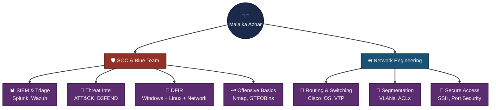
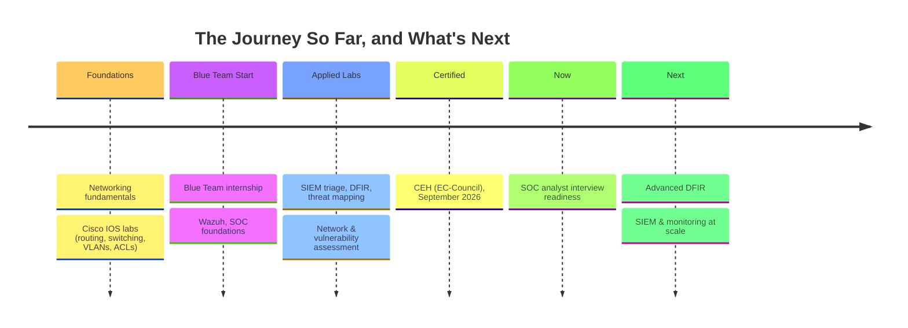

<div align="center">


<br/><br/>

<a href="https://git.io/typing-svg">
  
</a>

<br/>

[](https://www.linkedin.com/in/malaika-azhar-tech)
[](https://github.com/malaika-azhar)


</div>

<br/>

## 🏅 Certifications

<div align="center">

<a href="YOUR_VERIFICATION_LINK">
  
</a>

**Certified Ethical Hacker (C|EH)** · EC-Council · Issued September 2026
[Verify credential →](YOUR_VERIFICATION_LINK)


</div>

<br/>

## 🧠 About Me

```yaml
role:        Aspiring SOC Analyst | Blue Team | Network Engineering
education:   BSCS, Virtual University of Pakistan (2027)
experience:  Blue Team Internship (SOC operations, SIEM)
certified:   CEH (EC-Council), Cisco Cybersecurity, IBM Cybersecurity Fundamentals
focus:       ["SIEM & Alert Triage", "DFIR", "Threat Intel", "Cisco Networking"]
philosophy:  "I learn by building real systems, not just reading theory."
```

I'm a computer science student building a career in **SOC and Blue Team work**. My projects cover SIEM triage, log correlation, digital forensics and threat framework mapping, backed by **Cisco networking** basics: routing, switching, VLANs and access control.

I document real investigations end to end, including the wrong turns, because that's what the job actually looks like.

<br/>

## 🗺️ Skill Map


```mermaid
%%{init: {'theme': 'base', 'themeVariables': {'fontSize': '15px'}, 'flowchart': {'nodeSpacing': 30, 'rankSpacing': 44, 'padding': 10}}}%%
flowchart TB
    ME(("🧑‍💻<br/>Malaika Azhar")):::me --> SOC["🛡️ SOC & Blue Team"]:::soc
    ME --> NET["🌐 Network Engineering"]:::net
    SOC --> SIEM["📊 SIEM & Triage<br/>Splunk, Wazuh"]:::leaf
    SOC --> TI["🎯 Threat Intel<br/>ATT&CK, D3FEND"]:::leaf
    SOC --> DFIR["🔎 DFIR<br/>Windows + Linux + Network"]:::leaf
    SOC --> OFF["🗝️ Offensive Basics<br/>Nmap, GTFOBins"]:::leaf
    NET --> RS["🔀 Routing & Switching<br/>Cisco IOS, VTP"]:::leaf
    NET --> VLAN["🧩 Segmentation<br/>VLANs, ACLs"]:::leaf
    NET --> SEC["🔐 Secure Access<br/>SSH, Port Security"]:::leaf
    classDef me fill:#1B2A4A,stroke:#0B1A33,stroke-width:2px,color:#FFFFFF
    classDef soc fill:#943126,stroke:#571C16,stroke-width:2px,color:#FFFFFF
    classDef net fill:#1A5276,stroke:#0B2E43,stroke-width:2px,color:#FFFFFF
    classDef leaf fill:#5B2C6F,stroke:#3B1A48,stroke-width:2px,color:#FFFFFF
    linkStyle default stroke:#2C3E50,stroke-width:2px
```

<br/>

## 🛡️ SOC & Blue Team Toolkit

<table>
<tr>
<td valign="top" width="50%">

**SIEM & Triage**
- Splunk, Wazuh
- Evidence-backed TP/FP verdicts
- Escalation & remediation reporting

**Threat Intelligence**
- MITRE ATT&CK · D3FEND
- Pyramid of Pain indicator ranking
- Real-malware case mapping (WannaCry)

**Windows Forensics**
- Security Event Log analysis
- Prefetch analysis: `EvtxECmd`, `PECmd`

</td>
<td valign="top" width="50%">

**Linux Forensics**
- `auth.log`, `dpkg.log`, `syslog`, `auditd`
- Multi-source attacker timeline correlation

**Network Forensics**
- Wireshark: full attack-chain reconstruction
- Plaintext protocol credential extraction

**Offensive Fundamentals**
- Nmap, Gobuster, John the Ripper
- GTFOBins privilege-escalation techniques

</td>
</tr>
</table>

<br/>

## 🌐 Network Engineering Toolkit

<table>
<tr>
<td valign="top" width="50%">

**Routing & Switching**
- Cisco IOS configuration
- VTP server/client synchronization
- Trunking & Router-on-a-Stick

**Segmentation & Access Control**
- Multi-VLAN enterprise topologies
- Standard & extended ACLs, tested and hardened

</td>
<td valign="top" width="50%">

**Secure Access**
- SSH v2, port security, sticky MAC
- PortFast & BPDU Guard

**Addressing & Troubleshooting**
- Subnetting, static/DHCP per VLAN
- DNS, gateway, and routing diagnostics

</td>
</tr>
</table>

<br/>

## 💻 Tech Stack

<div align="center">


</div>

<br/>

## 🧪 Featured Labs

<div align="center">

| Lab | Focus | Key Tools |
|---|---|---|
| 🚨 SIEM Alert Triage | Two phishing alerts → opposite, evidence-backed verdicts | Splunk, TryHackMe |
| 🐧 Linux Log Forensics | Full attacker timeline from 4 correlated log sources | auth.log, auditd |
| 🕵️ Network Forensics | Full attack chain from a raw packet capture | Wireshark |
| 🦠 Threat Framework Mapping | WannaCry mapped to defensive countermeasures | ATT&CK, D3FEND |
| 💥 Vulnerability Assessment | Black-box pentest: recon → foothold → root | Nmap, GTFOBins |
| 🏢 Enterprise VLAN Routing | VTP-synced VLANs, hardened & ACL-filtered | Packet Tracer |

**[📂 See all labs →](https://github.com/malaika-azhar/Cybersecurity-Lab-Projects)**

</div>

<br/>

## 🤝 Open Source

- **[Uptime Kuma](https://github.com/louislam/uptime-kuma):** pull request [#7881](https://github.com/louislam/uptime-kuma/pull/7881), fixing drag-and-drop so a monitor can be moved out of a group hierarchy (`MonitorListItem.vue`).

<br/>

## 🧭 Current Learning Path


```mermaid
%%{init: {'theme': 'base', 'themeVariables': {'fontSize': '15px'}, 'timeline': {'disableMulticolor': false}}}%%
timeline
    title The Journey So Far, and What's Next
    Foundations : Networking fundamentals : Cisco IOS labs (routing, switching, VLANs, ACLs)
    Blue Team Start : Blue Team internship : Wazuh, SOC foundations
    Applied Labs : SIEM triage, DFIR, threat mapping : Network & vulnerability assessment
    Certified : CEH (EC-Council), September 2026
    Now : SOC analyst interview readiness
    Next : Advanced DFIR : SIEM & monitoring at scale
```

<br/>

## 📊 GitHub Stats

<div align="center">


<br/>


</div>

<br/>

## 🎯 Career Goal

Building a career as a **SOC Analyst (Blue Team)** or **Network/NOC Engineer**, grounded in hands-on investigation, hardened networking labs and a CEH certification rather than theory alone.

<br/>

<div align="center">

> *"I learn by building real systems, not just reading theory."*

</div>
