

<a href="https://www.linkedin.com/in/malaika-azhar-tech">
  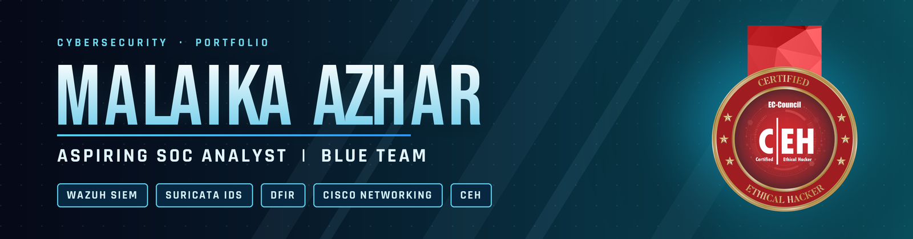
</a>

 

 

## 👩‍💻 About

BSCS student (Virtual University of Pakistan, 2027) targeting **SOC Analyst and Blue Team roles**.

During my Blue Team internship I built a working detection setup: Wazuh SIEM, Suricata IDS, a pfSense firewall and live threat intelligence feeds. Every project in my repositories is backed by screenshot evidence, including the failed attempts.

 

## 🏅 Certifications

I earned the **Certified Ethical Hacker (C|EH)** credential from EC-Council in September 2026. It sits alongside Cisco's Introduction to Cybersecurity and IBM's Cybersecurity Fundamentals. The credential can be checked on EC-Council's verification page with the certificate number below.

<a href="https://aspen.eccouncil.org/Verify">
  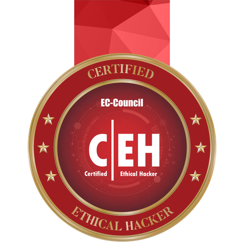
</a>

**Certified Ethical Hacker (C|EH)** · EC-Council · September 2026 · Certificate No. `ECC7025643981` · [Verify credential →](https://aspen.eccouncil.org/Verify)

 

## 📈 Internship Results

Results from my 12-week Blue Team internship: I documented every week in a report, loaded a URLhaus feed of 20,000+ malicious URLs into Wazuh, and mapped detections across 6 MITRE ATT&CK tactics. After patching openssh on a monitored endpoint, I re-scanned to confirm the findings on that package dropped from 30 to 6.

 

## 🧱 Lab Architecture

My lab is built around a Wazuh Manager that collects events from an Ubuntu server, a Windows host, a Suricata IDS on Kali Linux and a pfSense firewall. Threat intelligence from URLhaus and VirusTotal is added on top, and the alerts end up on a SOC dashboard.

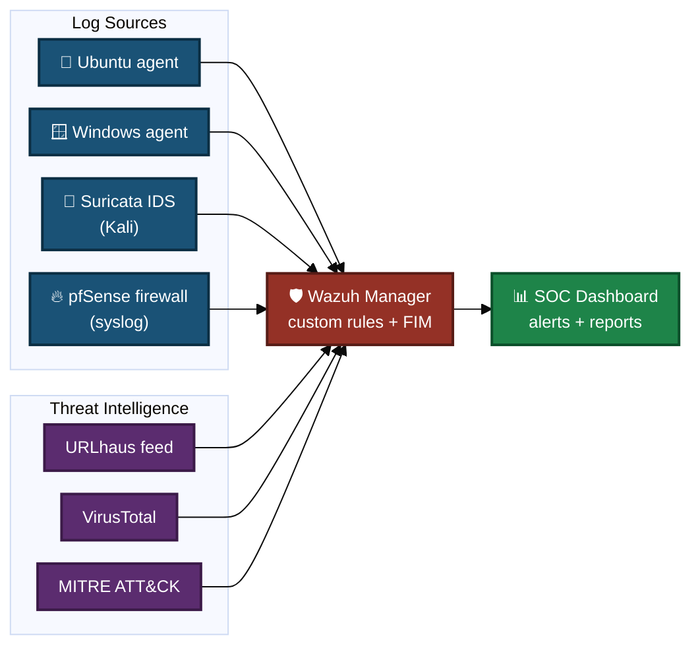
```mermaid
%%{init: {'theme': 'base', 'themeVariables': {'fontSize': '13px'}, 'flowchart': {'nodeSpacing': 18, 'rankSpacing': 30, 'padding': 8}}}%%
flowchart LR
    subgraph SRC["Log Sources"]
        UA["🐧 Ubuntu agent"]:::src
        WA["🪟 Windows agent"]:::src
        SU["🔎 Suricata IDS<br/>(Kali)"]:::src
        PF["🔥 pfSense firewall<br/>(syslog)"]:::src
    end
    subgraph TI["Threat Intelligence"]
        UH["URLhaus feed"]:::ti
        VT["VirusTotal"]:::ti
        AT["MITRE ATT&CK"]:::ti
    end
    UA --> WM
    WA --> WM
    SU --> WM
    PF --> WM
    UH --> WM
    VT --> WM
    AT --> WM
    WM["🛡️ Wazuh Manager<br/>custom rules + FIM"]:::core --> DB["📊 SOC Dashboard<br/>alerts + reports"]:::out
    classDef src fill:#1A5276,stroke:#0B2E43,stroke-width:2px,color:#FFFFFF
    classDef ti fill:#5B2C6F,stroke:#3B1A48,stroke-width:2px,color:#FFFFFF
    classDef core fill:#943126,stroke:#571C16,stroke-width:2px,color:#FFFFFF
    classDef out fill:#1E8449,stroke:#0B4F2A,stroke-width:2px,color:#FFFFFF
```

### Network Map

All lab machines sit in one internal network behind the pfSense firewall.

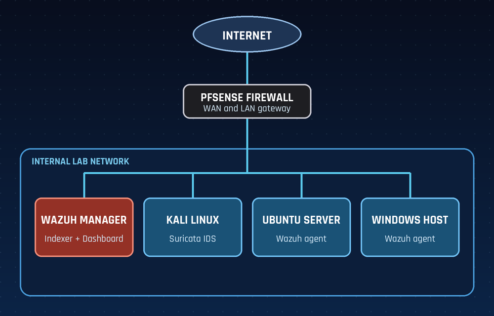

 

## 🔍 Detection Evidence

Screenshots from my Wazuh lab: custom rules, File Integrity Monitoring and a SOC dashboard.

<table>
<tr>
<td width="50%" align="center">
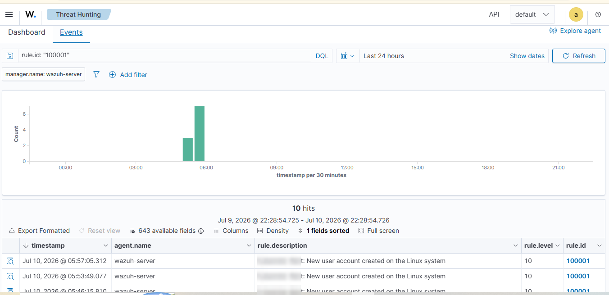
 <b>Custom rule 100001:</b> alert fires when a new Linux user account is created
</td>
<td width="50%" align="center">
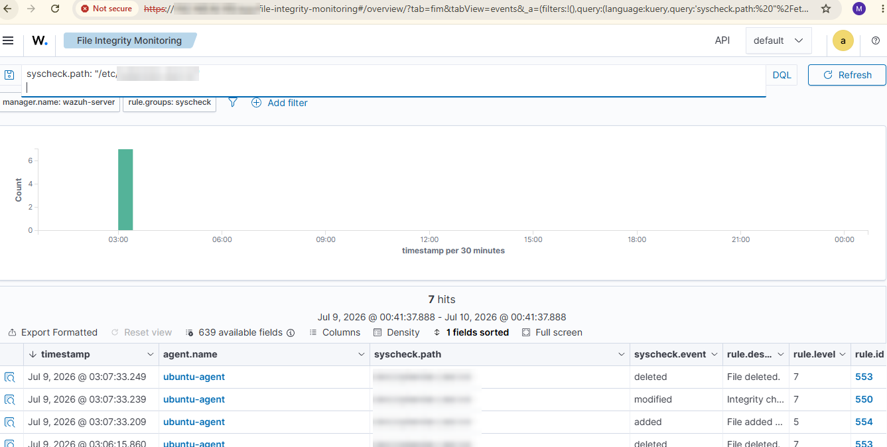
 <b>File Integrity Monitoring:</b> file added, modified and deleted events detected
</td>
</tr>
</table>

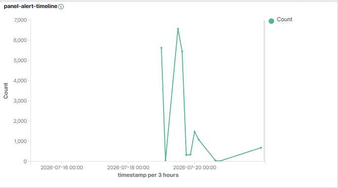
 <b>SOC dashboard:</b> alert volume over time, built in Wazuh

 

## 🧪 Featured Projects

<table>
<tr>
<td width="33%" align="center" valign="top">
<a href="https://github.com/malaika-azhar/Cybersecurity-Lab-Projects">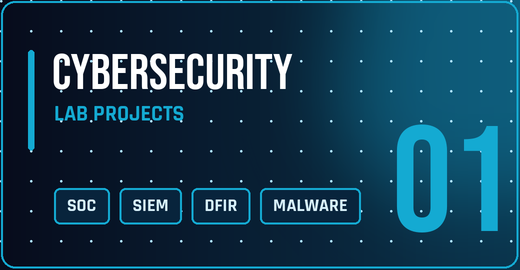</a>
 SOC, SIEM triage, DFIR, malware analysis, threat mapping
</td>
<td width="33%" align="center" valign="top">
<a href="https://github.com/malaika-azhar/Cisco-Networking-Lab-Portfolio">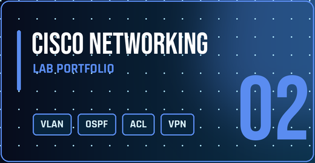</a>
 VLANs, OSPF/EIGRP, ACLs, IPsec VPN, port security
</td>
<td width="33%" align="center" valign="top">
<a href="https://github.com/malaika-azhar/Real-World-Tier2-Support-Projects">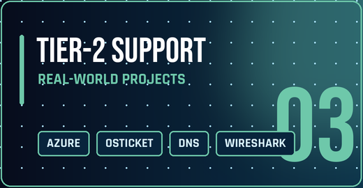</a>
 osTicket helpdesk on Azure, SPF/DKIM/DMARC audit, Wireshark fault analysis
</td>
</tr>
</table>

 

## 🗓️ Journey

I started with Cisco networking labs, moved into Blue Team work during my internship, and closed this period with the CEH certification and my first open source pull request.

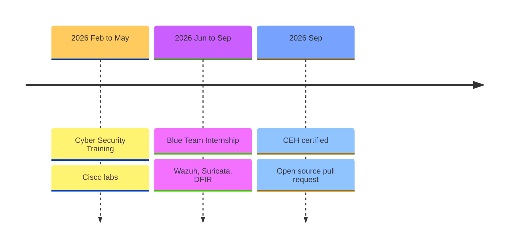
```mermaid
%%{init: {'theme': 'base', 'themeVariables': {'fontSize': '15px'}}}%%
timeline
    2026 Feb to May : Cyber Security Training : Cisco labs
    2026 Jun to Sep : Blue Team Internship : Wazuh, Suricata, DFIR
    2026 Sep : CEH certified : Open source pull request
```

**Cybersecurity Intern, Blue Team** · Cyberster · Jun 2026 to Sep 2026
- Deployed a Wazuh SIEM with File Integrity Monitoring and custom detection rules on Ubuntu and Windows endpoints.
- Wrote and tested Suricata IDS rules, and integrated the alerts into Wazuh.
- Added threat intelligence feeds (VirusTotal, URLhaus, MITRE ATT&CK) to the SIEM.
- Did malware analysis and digital forensics: disk imaging, Prefetch, registry and timeline correlation.

 

## 🛠️ Skills

My main focus is SIEM monitoring, detection rules and digital forensics, supported by networking and firewall knowledge.

  

| Area | Tools and topics |
|---|---|
| SIEM and detection | Wazuh, Suricata, Splunk, MITRE ATT&CK, D3FEND |
| Forensics and malware | Autopsy, Sleuth Kit, Prefetch, registry, ANY.RUN, VirusTotal |
| Network security | pfSense, Cisco IOS, Wireshark, ACLs, VPN |

 

## 🤝 Open Source

Pull request to Uptime Kuma fixing drag-and-drop of monitors out of a group hierarchy.

 

## 🎯 Career Goal

I am looking for a **SOC Analyst (Blue Team)** or **Network/NOC Engineer** role where I can keep building detection and investigation skills on real systems.

 

## 📬 Contact

[LinkedIn](https://www.linkedin.com/in/malaika-azhar-tech) · [malaikawork21@gmail.com](mailto:malaikawork21@gmail.com)
